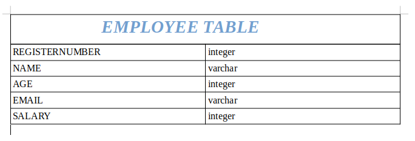

# Django ORM Web Application

## AIM
To develop a Django application to store and retrieve data from a database using Object Relational Mapping(ORM).

## Entity Relationship Diagram


## DESIGN STEPS

### STEP 1:
Develpoing Admin 

### STEP 2:
Creating a Database using Python codes

### STEP 3:
Adding necessary details in the database

## PROGRAM
```
settings.py

# Database
# https://docs.djangoproject.com/en/3.1/ref/settings/#databases

DATABASES = {
    'default': {
        'ENGINE': 'django.db.backends.sqlite3',
        'NAME': BASE_DIR / 'db.sqlite3',
    }
}
```

```
models.py

from django.db import models
from django.contrib import admin

# Create your models here.
class Employee(models.Model):
    registernumber=models.CharField(max_length=20,help_text='register number')
    name=models.CharField(max_length=100)
    age=models.IntegerField()
    email=models.EmailField()
    salary=models.IntegerField()

class EmployeeAdmin(admin.ModelAdmin):
    list_display=('registernumber','name','age','email','salary')
```

```
admin.py

from django.contrib import admin
from .models import Employee,EmployeeAdmin

# Register your models here.
admin.site.register(Employee,EmployeeAdmin)
```


## OUTPUT


## RESULT
The Database is created successfully